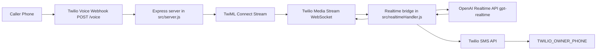

# Voice AI System

A Node.js voice assistant backend that connects live Twilio phone calls to the OpenAI Realtime API, runs a persona-driven assistant (Victoria), and forwards captured caller messages/self-notes to Tom by SMS.

## System Purpose

This system is built for two primary call flows:
- External callers can ask about Tom's background, work, and technical skills, then leave a structured message.
- Tom can call his own number to leave himself a quick voice note.

When the assistant confirms a message, it calls a single tool (`capture_message`) and dispatches the payload to `TWILIO_OWNER_PHONE` over SMS.

## Languages and Core Technologies

### Languages
- JavaScript (Node.js, ES modules)
- XML (TwiML generated at runtime for Twilio)

### Runtime and Server
- Node.js 18+
- Express (`/voice` webhook and `/health`)
- Native `http` server (hosts both HTTP endpoints and WS server)

### Realtime and Telephony
- `ws` WebSocket server for Twilio Media Streams
- Twilio Programmable Voice (`<Connect><Stream>`) for call audio ingress
- Twilio REST API for SMS delivery of captured messages

### AI and Speech
- OpenAI Realtime API (`gpt-realtime`)
- Realtime server VAD (`server_vad`) for turn detection and interruption behavior
- OpenAI transcription model (`gpt-4o-transcribe`) for input audio transcription

### Configuration and Developer Tooling
- `dotenv` for environment variable loading
- `nodemon` for local autoreload during development

## Current vs Dormant Components

### Actively used in runtime path
- `src/server.js`
- `src/realtimeHandler.js`
- `twilio`, `ws`, `express`, `dotenv`

### Present but currently dormant or unused
- `src/firebase.js` and `firebase-admin` dependency (not in active call path)
- `src/twilioWebhook.js` helper (not wired in `src/server.js`)
- `@openai/agents` and `@openai/agents-extensions` packages (installed, not referenced by active code)

## Architecture Overview



## End-to-End Call Flow

1. Twilio sends `POST /voice` to the app.
2. `src/server.js` returns TwiML with `<Connect><Stream ...>` pointing to `/realtime`.
3. Twilio opens a WebSocket stream and sends media/control events.
4. `src/realtimeHandler.js` opens a second WebSocket to OpenAI Realtime.
5. Audio frames are forwarded from Twilio to OpenAI (`input_audio_buffer.append`).
6. OpenAI returns response audio deltas; bridge forwards them back to Twilio.
7. On user barge-in, the bridge sends Twilio `clear` and OpenAI `response.cancel`.
8. When Victoria confirms a message, model calls `capture_message`.
9. Bridge validates/normalizes payload, formats outbound text, and sends SMS via Twilio.
10. Assistant confirms success/failure to the caller and logs a concise call summary.

## Realtime Session Design

`connectToOpenAI()` initializes realtime with:
- Model: `gpt-realtime`
- Output audio modality with `audio/pcmu`
- Input transcription: `gpt-4o-transcribe`
- Turn detection: `server_vad`

`attachRealtimeServer()` manages:
- Twilio stream lifecycle (`start`, `media`, `mark`, `stop`, close/error)
- OpenAI lifecycle (`session.*`, `response.*`, function call deltas)
- Function-call assembly for `capture_message`
- Usage accounting (`input/output/audio/cached token` aggregates)

## Tool Contract: `capture_message`

The assistant uses one function tool:
- `mode`: `caller_message | self_note`
- `callerName`: nullable string
- `contactPhone`: nullable string
- `contactEmail`: nullable string
- `subject`: string
- `messageBody`: string
- `callbackRequested`: boolean
- `priority`: `low | normal | high`

Behavior notes:
- Missing contact phone falls back to caller ID when available.
- `TWILIO_OWNER_PHONE` caller ID match marks the call as self-note context.
- Tool output always includes `{ delivered, channel: "sms", reason? }`.

## Directory Map

- `src/server.js`: Express endpoints, TwiML response, server bootstrap
- `src/realtimeHandler.js`: Twilio/OpenAI realtime bridge, prompt/instructions, message capture, SMS dispatch
- `src/twilioWebhook.js`: Alternate Twilio webhook helper (currently not wired)
- `src/firebase.js`: Dormant Firebase admin initialization (not used in active flow)
- `.env.example`: runtime configuration template

## Environment Variables

### Required for core call + AI flow
- `OPENAI_API_KEY`
- `TWILIO_STREAM_URL`
- `TWILIO_ACCOUNT_SID`
- `TWILIO_AUTH_TOKEN`

### Required for SMS delivery
- `TWILIO_OWNER_PHONE`
- `TWILIO_SMS_FROM` (or set `PHONE_RELAY_NUMBER` as fallback sender)

### Optional
- `OPENAI_REALTIME_ENDPOINT` (runtime forces model query param to `gpt-realtime`)
- `PHONE_RELAY_NUMBER`
- `PORT` (default `8080`)
- `VERBOSE_OPENAI_LOGS=true` for deeper event logs

### Dormant
- `FIREBASE_SERVICE_ACCOUNT_JSON` (not needed in current runtime path)

## Local Development

1. Install dependencies:
```bash
npm install
```

2. Copy environment template and fill values:
```bash
cp .env.example .env
```

3. Run locally:
```bash
npm run dev
```

4. Health check:
```bash
curl http://localhost:8080/health
```

5. Expose local server (example with ngrok) and configure Twilio Voice webhook to `POST https://<your-domain>/voice`.

## Operational Notes

- If SMS config is missing, voice conversation still works; message dispatch returns `delivered: false` and assistant communicates possible delay.
- No persistent datastore is currently in the active flow; call/message handling is in-memory per session plus logs.
- Firebase can be reintroduced later through a storage adapter path without changing call transport architecture.

## Troubleshooting

- `TWILIO_STREAM_URL not configured`: set `TWILIO_STREAM_URL` in `.env`.
- OpenAI connection fails: verify `OPENAI_API_KEY` and network egress.
- No SMS delivered: verify `TWILIO_OWNER_PHONE`, `TWILIO_SMS_FROM`, and Twilio credentials.
- Assistant talks but cannot send message: check logs for `capture_message` tool output and SMS error reason.
